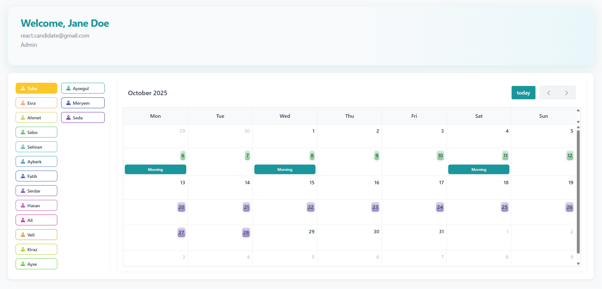
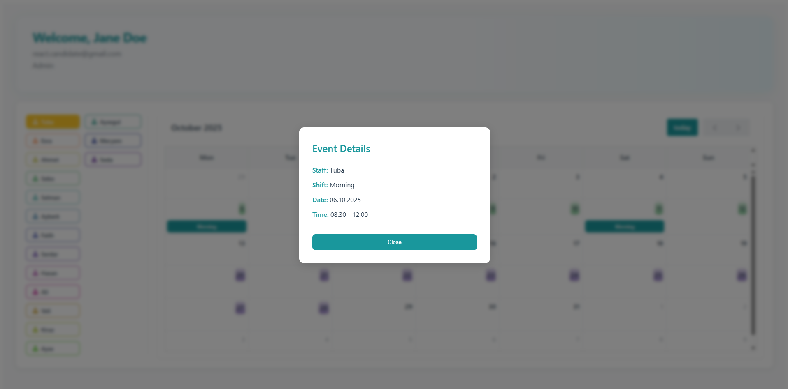
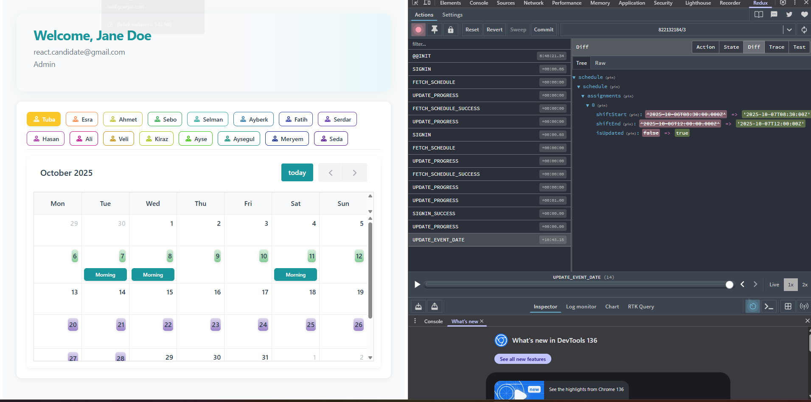

# Smart Maple - Takvim Yönetim Uygulaması 🗓️

Bu proje, **Smart Maple** şirketi için özel olarak geliştirilmiştir.  
Amaç; şirket içi görev dağılımı, personel eşleşmeleri (pair) ve takvim yönetimini kullanıcı dostu bir arayüzle kolaylaştırmaktır.

---

## 🚀 Kurulum ve Çalıştırma

Projeyi başlatmak için aşağıdaki komutları çalıştırabilirsiniz:

```bash
npm install --legacy-peer-deps
npm run dev
```

Tamamlanan Geliştirmeler

1. 🔐 ProfileCard Bileşeni – Rol Gösterimi 
Kullanıcı profili null geldiğinde oluşan hata düzeltildi.

localStorage üzerinden alınan kullanıcı rolü doğru şekilde gösteriliyor.

2. 📅 Takvim Başlangıç Tarihi ve Etkinlik Popup 
Takvim, schedule verisindeki en erken tarih ile başlatılıyor.

Etkinlik detayları popup bileşeni ile gösteriliyor.

3. 🔍 Personel Bazlı Filtreleme 
Sadece seçili personelin etkinlikleri takvimde listeleniyor.

Redux state'i üzerinden filtreleme işlevi sağlandı.

4. 🎨 Pair Günleri – Renkli Arka Plan ile Gösterim 
.pair-staff-N sınıflarına özel degrade arka planlar eklendi.

CSS özellikleri: border-radius: 6px; padding: 3px; box-shadow.


5. 🔁 Drag and Drop Özelliği 
Görevler takvim üzerinde sürüklenip bırakılabiliyor.

Yeni tarih bilgisi Redux store'a aktarılıyor.

6. 🧩 UI/UX İyileştirmeleri
Renkler, gölgeler, köşeler ve padding’ler ile modern görünüm sağlandı.

Mobil uyumlu (responsive) tasarım geliştirildi.

Bileşen yapısı sadeleştirildi ve tekrar kullanılabilir hâle getirildi.


📸 Ekran Görüntüleri
🔹 

🔹 

🔹 

✨ Teşekkürler
